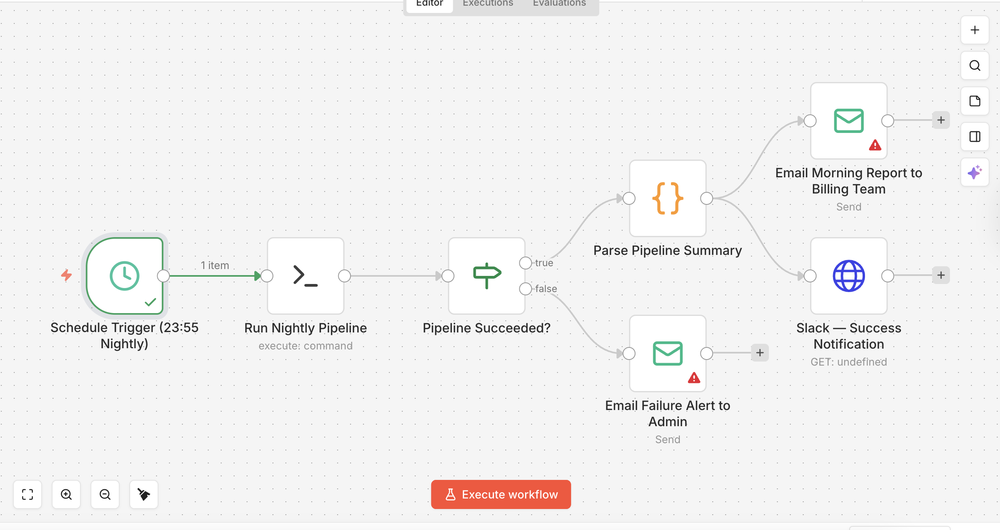

# Agentic Healthcare Claims Engine

> **AI-powered pre-submission claims scrubbing and medical necessity adjudication — built by a physician-executive at the intersection of clinical medicine and healthcare administration.**

---

## About the Author

Built by an AI engineer holding an **MBBS** and a **Master of Health Administration (MHA)** — a rare combination that eliminates the need for a physician consultant to validate clinical reasoning or a billing expert to sanity-check outputs. The MBBS grounds the RAG prompts, medical necessity logic, and appeal generation in real clinical literacy; the MHA frames the denial problem as the workflow and information gap it actually is. The domain knowledge is built into the architecture.

---

## n8n Workflow



*The n8n workflow orchestrates the full nightly pipeline: a Schedule trigger fires at 11:55 PM, pulling claims from the EHR and passing them through the RAG scrubbing engine. Claude evaluates each claim against the relevant CMS LCD/NCD policy and returns a structured decision. An IF node then routes the result — approved claims are forwarded automatically to the clearinghouse, while denied or flagged claims are held in a queue with a pre-written appeal letter attached. A morning report is dispatched to the billing team by 6 AM, so staff arrive to decisions, not a manual review queue.*

---

## What This Is

The **Agentic Healthcare Claims Engine** is a production-grade AI system that reviews medical claims against CMS Local Coverage Determinations (LCDs) and National Coverage Determinations (NCDs) before they are submitted to an insurance payer.

It is not a rules engine. It does not pattern-match billing codes against a lookup table.

It reads the actual policy language — the same documents a human insurance reviewer reads — and reasons about whether the clinical documentation in a claim satisfies the coverage criteria for the procedure being billed. When it finds a gap, it explains exactly what is missing and why, using the same ANSI denial code taxonomy the payer would use. When a claim is likely to be denied, it generates a complete, clinician-authored appeal letter — ready for submission — before the claim ever reaches the payer.

**The result:** denials caught at the source, not 90 days later.

---

## The Core Problem

Healthcare claims denials are not random. The most common reasons — missing prior authorization, insufficient documentation of conservative therapy failure, absent medical necessity justification — are entirely predictable from the published policy documentation. Yet most billing workflows submit claims first and fight denials later, at a cost of $25–$118 per appeal and 30–90 days of delayed revenue per claim.

This engine inverts that workflow.

---

## Architecture: 3-Layer Autonomous Pipeline

```
┌──────────────────────────────────────────────────────────────────┐
│  LAYER 1 — NIGHTLY INGESTION  (11:55 PM)                        │
│  Pull claims from EHR (FHIR R4 API / SQL / SFTP CSV drop)       │
│  → Normalize to structured FHIR format                           │
└────────────────────────┬─────────────────────────────────────────┘
                         │
┌────────────────────────▼─────────────────────────────────────────┐
│  LAYER 2 — RAG SCRUBBING ENGINE  (midnight)                     │
│  Retrieval-Augmented Generation over CMS policy PDFs            │
│  → Claude reasons: does this claim meet coverage criteria?       │
│  → Decision: APPROVED | DENIED | APPEAL_RECOMMENDED | PENDING   │
└────────────────────────┬─────────────────────────────────────────┘
                         │
┌────────────────────────▼─────────────────────────────────────────┐
│  LAYER 3 — ROUTING + REPORTING  (12:30 AM)                      │
│  APPROVED      → auto-submit to clearinghouse/payer             │
│  DENIED        → hold queue + pre-written appeal letter          │
│  APPEAL/PENDING → hold queue + billing team alert               │
│  Morning report (PDF + CSV) → billing team inbox by 6 AM        │
└──────────────────────────────────────────────────────────────────┘
```

The engine runs autonomously on a nightly schedule. The billing team arrives to a report, not a queue of manual reviews. Claims that pass go out automatically. Claims that would fail stay in-house with a pre-written appeal ready to file.

---

## Technical Stack

| Component | Technology |
|---|---|
| API Framework | FastAPI (Python 3.11) |
| LLM (adjudication + appeal generation) | Claude (Anthropic) — `claude-sonnet-4-6` |
| Embeddings | OpenAI `text-embedding-3-small` |
| RAG Framework | LlamaIndex |
| Vector Store | ChromaDB (default) / Qdrant (optional) |
| Data Validation | Pydantic v2 — FHIR R4 claim schema |
| EHR Connectivity | FHIR R4 API / SQLAlchemy / SFTP (paramiko) |
| Report Generation | ReportLab (PDF) |
| Scheduling | APScheduler / cron / n8n |
| Observability | structlog (structured JSON logging) |

---

## Key Capabilities

### Pre-Submission Claims Scrubbing
Every claim is reviewed against the relevant CMS LCD/NCD **before** it is submitted. The engine returns a structured decision with:
- `decision`: APPROVED / DENIED / APPEAL_RECOMMENDED / PENDING_INFO
- `denial_code`: ANSI/CMS reason code (CO-50, CO-97, etc.)
- `clinical_gap`: the specific documentation gap between the claim and the policy
- `policy_reference`: the exact LCD/NCD section governing the decision
- `confidence_score`: 0.0–1.0 calibrated confidence
- `reasoning`: step-by-step adjudication trace
- `appeal_letter`: complete formal appeal (populated for denied claims)

### Autonomous Nightly Pipeline
Claims are pulled from the EHR at 11:55 PM, scrubbed overnight, and routed by 12:30 AM. Approved claims are forwarded to the clearinghouse. Denied claims are held with pre-written appeals. A PDF + CSV morning report is in the billing team's inbox before they arrive.

### Policy Knowledge Base
The vector store is built from the same CMS LCD/NCD PDFs that govern payer adjudication. Adding coverage for a new specialty or procedure is a single command:
```bash
python scripts/add_policy.py --source /path/to/LCD_L38672_ChronicPain.pdf
```

### EHR Integration
Three connection modes:
- **FHIR R4 API** — Epic, Cerner, Athenahealth (SMART on FHIR)
- **Direct SQL** — PostgreSQL, MySQL, SQL Server, SQLite
- **SFTP CSV** — Legacy EHR nightly file exports

---

## Quick Start

### 1. Install dependencies
```bash
python -m venv .venv && source .venv/bin/activate
pip install -r requirements.txt
```

### 2. Configure environment
```bash
cp .env.example .env
# Set ANTHROPIC_API_KEY and OPENAI_API_KEY
```

### 3. Add CMS policy PDFs
```bash
# Drop LCD/NCD PDFs into:
data/policy_kb/

# Or use the add_policy script:
python scripts/add_policy.py --source /path/to/LCD_L39240.pdf
```

### 4. Index the policies (run once, re-run when adding new PDFs)
```bash
python scripts/ingest_policies.py
```

### 5. Start the API server
```bash
python app/main.py
# API docs: http://localhost:8000/docs
```

### 6. Verify a single claim
```bash
curl -X POST http://localhost:8000/verify-claim \
  -H "Content-Type: application/json" \
  -d @data/mock_claims/denial_test_001.json
```

### 7. Run a batch (CSV input)
```bash
python scripts/batch_processor.py --input data/batch_input/claims.csv
```

### 8. Run the full nightly pipeline
```bash
python scripts/nightly_pipeline.py --run-now --source csv
```

---

## Scheduling (Autonomous Nightly Run)

**Option A — System cron (simplest):**
```bash
55 23 * * * /path/to/.venv/bin/python /path/to/scripts/nightly_pipeline.py
```

**Option B — n8n (recommended for full workflow automation):**
Connect an n8n Schedule node at 11:55 PM to an Execute Command node running `nightly_pipeline.py`. Use IF nodes to route decisions to Payer API, Email, or Slack nodes. n8n's visual pipeline makes it easy to wire in EHR API authentication, payer submission, and team notifications without touching code.

**Option C — Persistent Python daemon:**
```bash
python scripts/nightly_pipeline.py --scheduler
```

---

## API Reference

### `POST /verify-claim`
Accepts a FHIR-structured claim. Returns a structured adjudication decision.

**Example response:**
```json
{
  "claim_id": "DENIAL-TEST-001",
  "decision": "DENIED",
  "denial_code": "CO-50",
  "denial_code_description": "Non-covered service — not deemed medically necessary.",
  "clinical_gap": "Documentation does not support failure of conservative therapy. 10-day PT trial is below the minimum threshold required by LCD L39240.",
  "policy_reference": "LCD L39240 Section 4.1 — Indications and Limitations of Coverage",
  "confidence_score": 0.91,
  "reasoning": "The claim requests CPT 62323 (lumbar epidural steroid injection) for M54.5 (Low Back Pain). LCD L39240 requires documented failure of at least 6 weeks of conservative therapy. Clinical notes reference a 10-day PT trial, which does not meet this threshold. Prior authorization was not obtained. Decision: DENIED.",
  "appeal_letter": "Dear Aetna Medical Review Board,\n\nWe are writing on behalf of patient Jane Smith (Member ID: MEM-44321)...",
  "processed_at": "2026-03-17T23:58:44.123456+00:00"
}
```

### `GET /health`
Returns service status, loaded model, and whether the policy index is ready.

---

## Project Structure

```
healthcare-claims-rag/
├── app/
│   ├── main.py                      # FastAPI app + lifespan
│   ├── core/
│   │   ├── config.py                # Settings (Pydantic)
│   │   └── logging.py               # Structured logging (structlog)
│   ├── api/routes/
│   │   ├── claims.py                # POST /verify-claim
│   │   └── health.py                # GET /health
│   ├── rag/
│   │   ├── indexer.py               # PDF → ChromaDB/Qdrant
│   │   ├── retriever.py             # Policy context retrieval
│   │   └── embeddings.py            # OpenAI embedding config
│   ├── claims/
│   │   ├── models.py                # FHIR Pydantic models
│   │   ├── processor.py             # Claim → RAG query
│   │   └── decision_engine.py       # Adjudication orchestrator
│   ├── prompts/
│   │   ├── medical_necessity.py     # Claude evaluation prompt
│   │   └── appeal_letter.py         # Appeal generation prompt
│   └── output/formatter.py          # ClaimDecision response model
├── data/
│   ├── policy_kb/                   # CMS LCD/NCD PDFs (not committed)
│   ├── mock_claims/                 # Anonymized FHIR test claims
│   ├── batch_input/                 # CSV drop zone for batch runs
│   ├── batch_output/                # Timestamped CSV + PDF reports
│   └── vector_store/                # ChromaDB persistence (not committed)
├── scripts/
│   ├── ingest_policies.py           # Index PDFs into vector store
│   ├── batch_processor.py           # Batch CSV/SQL → evaluate → report
│   ├── add_policy.py                # Add new CMS PDFs + re-index
│   ├── ehr_connector.py             # EHR FHIR API / SQL / SFTP connectors
│   ├── nightly_pipeline.py          # Full nightly orchestration
│   └── generate_mock_claims.py      # Test data generator
├── tests/
│   ├── test_claims.py               # Unit tests — models + processor
│   ├── test_api.py                  # Integration tests — endpoints
│   └── test_rag.py                  # Retriever tests
├── .env.example                     # Environment variable template
├── docker-compose.yml               # Qdrant (optional)
├── pyproject.toml
└── requirements.txt
```

---

## Running Tests
```bash
pytest tests/ -v
```

---

## Important Notes on Data Privacy

- **Never commit `.env`** — it contains API keys.
- **Never commit real patient data** — `data/batch_input/`, `data/batch_output/`, and `data/hold_queue/` are excluded from version control by `.gitignore`.
- Mock claims in `data/mock_claims/` are entirely synthetic and contain no real patient information.
- If deploying in a clinical environment, ensure the deployment infrastructure meets HIPAA requirements for PHI handling (encryption at rest, access controls, audit logging).

---

## Roadmap

- [ ] FHIR R4 Patient + Practitioner resource enrichment (full demographic pull)
- [ ] Payer-specific policy profiles (Aetna, BCBS, UHC rule sets)
- [ ] Real-time claim scrubbing webhook (submit claim → decision in <10s)
- [ ] Billing team dashboard (React + FastAPI)
- [ ] Prior authorization automation (submit PA requests via payer API)
- [ ] HL7 v2 / EDI 837 ingestion support
